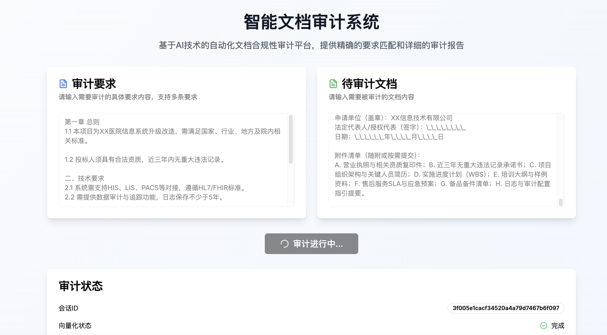
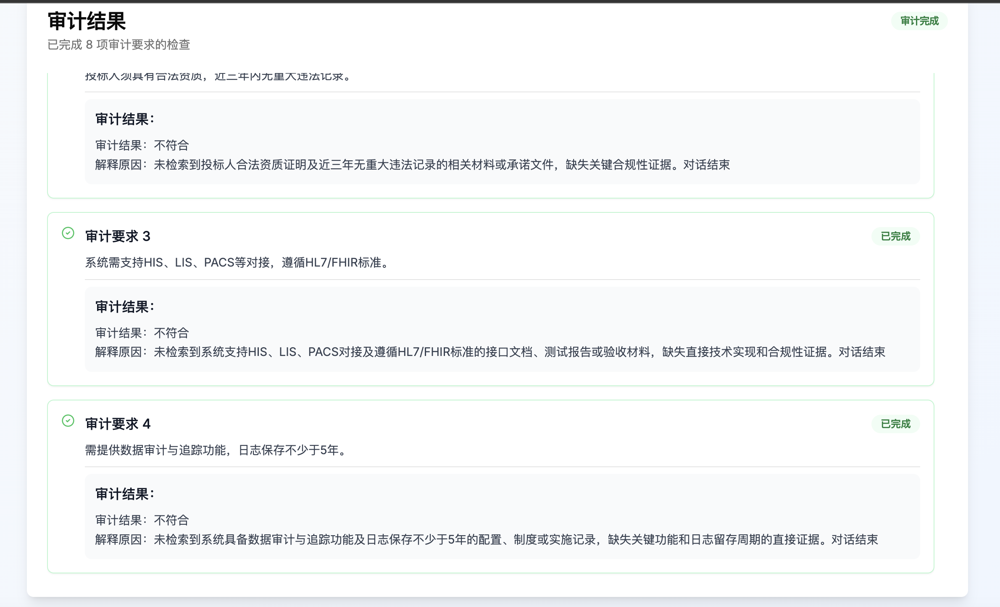

# 智能审计系统

# 后端
backend

# 前端
frontend
## 安装
安装nextjs命令
npm install -g next
安装所有依赖
cd frontend
pnpm install

# 整个逻辑
1. 用户输入审计要求文档和待审计文档. -- main_entry
2. 对审计文档使用Agent extract_audit_requirment.py 提取所有的审计要求，得到主逐条审计要求.  -- main_entry
3. 对待审计文档进行向量化，得到向量化的file_id.  -- knowledge_server
4. 逐条根据审计要求和得到的file_id，调用audit_agent,使用工具持续的进行向量检索，得到审计结果 --- audit_agent
5. 返回给前端所有的步骤的状态.

# 截图

