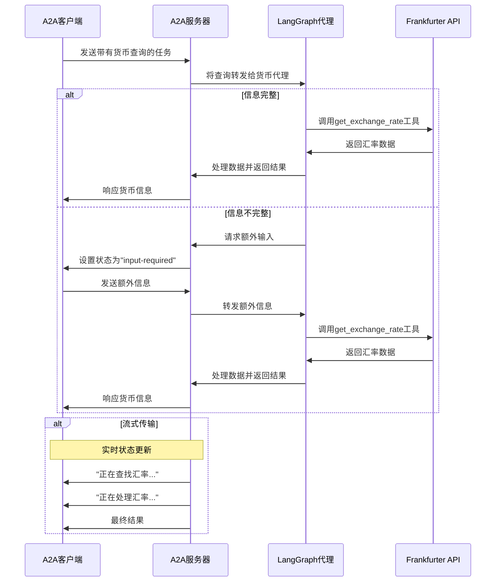

# 使用A2A协议的LangGraph货币代理

这个示例演示了一个使用[LangGraph](https://langchain-ai.github.io/langgraph/)构建并通过A2A协议暴露的货币转换代理。它展示了支持多轮对话和流式响应的会话交互。

## 文件目录

* 单个的stream测试
[a2a_client_single.py](a2a_client_single.py)

* 测试传入历史会话
[a2a_client_history.py](a2a_client_history.py)


## 工作原理

该代理使用LangGraph和LLM（例如Google Gemini）通过ReAct代理模式提供货币兑换信息。A2A协议实现了与代理的标准化交互，允许客户端发送请求并接收实时更新。




## 主要特性

- **多轮对话**：代理在需要时可以请求额外信息
- **实时流式传输**：在处理过程中提供状态更新
- **推送通知**：支持基于webhook的通知
- **会话记忆**：在交互中保持上下文
- **货币兑换工具**：与Frankfurter API集成以获取实时汇率

## 先决条件

- Python 3.12或更高版本
- 访问.env，配置 LLM和API密钥, cp env_template .env，然后修改
- pip install -r requirements.txt


1. 运行代理：

   ```bash
   cp env_template .env
   # 修改.env中要使用的模型
   python main.py --host 0.0.0.0 --port 10000
   ```


2. 在单独的终端中运行测试客户端：

   ```bash
   python a2a_client.py
   ```


## 构建容器镜像

代理也可以使用容器文件构建。

1. 导航到`backend/knowledge_agent`目录：

  ```bash
  cd backend/knowledge_agent
  ```


2. 构建容器文件

    ```bash
    podman build . -t langgraph-a2a-server
    ```


> [!Tip]  
> Podman是`docker`的直接替代品，也可以在这些命令中使用。

3. 运行容器

    ```bash
    podman run -p 10000:10000 -e GOOGLE_API_KEY=your_api_key_here langgraph-a2a-server
    ```


4. 运行A2A客户端（按照上面第5步操作）

> [!Important]
> * **访问URL：** 您必须通过URL `0.0.0.0:10000` 访问A2A客户端。使用`localhost`将无法工作。
> * **主机名覆盖：** 如果您部署到容器外定义不同主机名的环境中，请使用`HOST_OVERRIDE`环境变量设置代理卡上的预期主机名。这确保与客户端应用程序的正确通信。

## 技术实现

- **LangGraph ReAct代理**：使用ReAct模式进行推理和工具使用
- **流式支持**：在处理过程中提供增量更新
- **记忆**：在回合之间保持对话状态（相同taskid和contextid)
- **历史记录记忆**：用户提供历史记录也可以记忆
- **A2A协议集成**：完全符合A2A规范
- **LLM token Stream**: 
